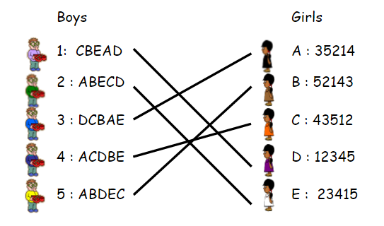

# Bipartite Graphs
Graph: Structure with verticies/nodes and edges
(Edges: Connections between verticies)

Example of a bipartite (two-sided) graph:

(Image from https://fiveable.me/methods-of-mathematics-calculus-statistics-and-combinatorics/unit-12/stable-marriage-problem/study-guide/QYJWEf2NDRyL8C2v)

An example of a real-life stable-marriage problem is assigning residents to hospitals. 

A stable solution does NOT mean that everyone is happy, it is not the best solution. Rather, it is a solution where there is no more improvements that can be made.

# Marriage Problem Solutions
For n students, m hospitals:
- Brute force will require $n!$ combinations
- Gale-Shapley requires $n \times m$ combinations, which is less

## Brute-Force (Try Every Combination):
- N! ways to order N items
- Can obtain "best" match
- Too computationally expensive, too many options for large selection

## Gale-Shapley Algorithm
- Finds a stable match, not best match
- Actual algorithm used for mediacal residency matching (irl)

Gale-Shapley Process:
- Start with an unmatched object (student), try to match it with its first choice (hospital)
- If its choice is not occupied, match
- If object is an improvement over current occupier of choice, match
- Continue until no improvements are possible.
